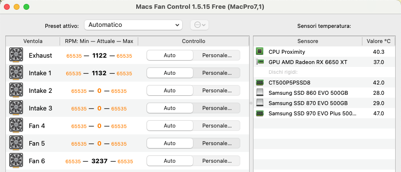
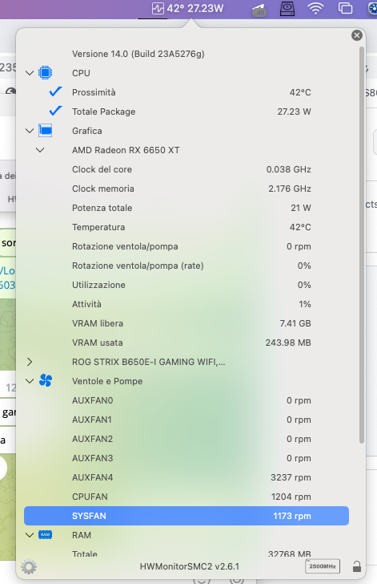

# SMCProcessorAMD

VirtualSMC plugin for AMD CPU temperature

(For fan reading use kext SMCSuperIO)

[Macs Fan Control](https://github.com/crystalidea/macs-fan-control/releases)

[HWMonitorSMC2](https://github.com/CloverHackyColor/HWMonitorSMC2/releases)

## Supported Systems
- macOS Sonoma       14.x       (MinKernel 23.0.0 - MaxKernel 23.99.99)
- macOS Ventura      13.x       (MinKernel 22.0.0 - MaxKernel 22.99.99)
- macOS Monterey     12.x       (MinKernel 21.0.0 - MaxKernel 21.99.99)
- macOS Big Sur      11.x       (MinKernel 20.0.0 - MaxKernel 20.99.99)
- macOS Catalina     10.15.x    (MinKernel 19.0.0 - MaxKernel 19.99.99)
- macOS Mojave       10.14.x    (MinKernel 18.0.0 - MaxKernel 18.99.99)
- macOS High Sierra  10.13.x    (MinKernel 17.0.0 - MaxKernel 17.99.99) 

## Old systems not supported

## Credits
- [Apple](https://www.apple.com) for macOS
- [vit9696](https://github.com/vit9696) for [VirtualSMC](https://github.com/acidanthera/VirtualSMC)
- [trulyspinach](https://github.com/trulyspinach) thank you immensely for your commitment and development
 [SMCAMDProcessor](https://github.com/trulyspinach/SMCAMDProcessor)
- [hieplpvip](https://github.com/hieplpvip) for [Script bootstrap.sh](https://github.com/hieplpvip/AsusSMC/blob/master/Scripts/bootstrap.sh)
- [mbarbierato](https://github.com/mbarbierato) for developing this VSMC plugin
